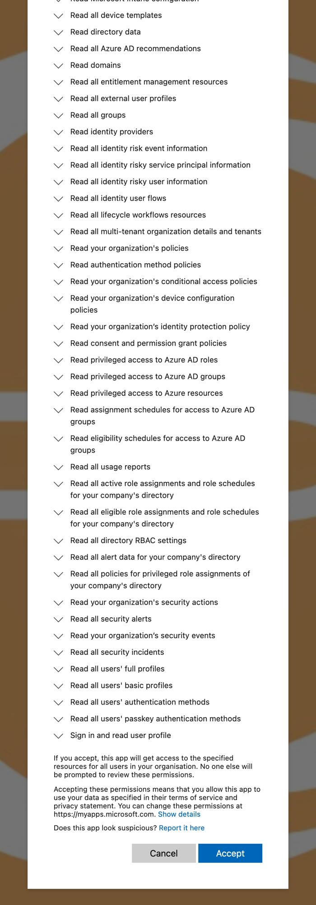

# entraid-discovery-app

Provision a **least-privilege, TPM-bound Microsoft Entra ID app registration** for the
Phase 1 discovery stage of an Entra ID security assessment.

Where a general-purpose "everything an Entra/M365 audit might ever need" app registration is
deliberately broad, **this app registration is deliberately narrow**: it carries only the
read permissions the Phase 1 discovery runbook actually uses, and — by default — it
authenticates with a **certificate whose private key is sealed in a TPM** rather than a
client secret, so the credential is bound to a single, customer-controlled Windows 11
endpoint. Engagements that cannot meet that bar can select a weaker credential pathway via
`-CredentialMode` — always as an explicit, disclosed opt-in, never a silent fallback (see
[Credential pathways](#credential-pathways)).

> **New to the tool?** Start with the
> [customer provisioning runbook](docs/customer-provisioning-runbook.md) — a step-by-step,
> portal-consent walkthrough from key generation to a working token.

---

## Why this project exists

Two requirements shape the design:

1. **Right-sized permissions.** A general-purpose audit app over-exposes the customer. This
   app requests exactly the read permissions the Phase 1 discovery runbook uses — each one
   mapped to the runbook module that needs it — and nothing else: every permission is
   read-only, and the set contains **no mailbox- or message-content permissions**.
2. **Hardware-bound credential.** The customer gets assurance that the credential can only be
   used from a specific Windows 11 endpoint: the endpoint is provisioned, the private key is
   generated inside that machine's TPM and is non-exportable, and only the public certificate
   is registered on the app. The credential physically cannot be used from any other machine.

---

## How authentication works

This section describes the **default (`TpmBound`) credential pathway**; the four explicit
alternatives are covered in [Credential pathways](#credential-pathways). Two things combine to
give a credential that is both least-privilege and machine-bound:

1. **Certificate credential instead of a client secret.** Only the public certificate
   (`.cer`) is uploaded to the app registration. The client proves its identity by signing a
   JWT *client assertion* with the private key. Microsoft recommends certificates over
   secrets.
2. **TPM-bound, non-exportable private key.** The key is generated with the
   **Microsoft Platform Crypto Provider** (the TPM-backed CNG KSP), marked non-exportable.
   The key material is created inside the TPM and cannot be copied to another machine.

```
   ┌────────────────────────────┐         ┌──────────────────────────────┐
   │ Windows 11 endpoint (TPM)  │         │ Microsoft Entra ID (tenant)  │
   │                            │         │                              │
   │  TPM ── private key ───────┼─ signs ─┤  app registration            │
   │          (non-exportable)  │  JWT    │   └─ public cert (.cer)      │
   │                            │ assert. │   └─ read-only Graph perms   │
   └────────────────────────────┘         └──────────────────────────────┘
```

### What the machine-lock actually guarantees (and what it doesn't)

Entra does **not** verify *which machine* a token request came from. It only verifies that
the caller holds the private key matching the registered public key. The machine-binding is
enforced entirely by the TPM refusing to let the key leave the device. Be precise:

- The credential is **unusable from any other device** — the private key cannot be
  exfiltrated.
- The TPM stops key *exfiltration*, not local *use*. A local administrator (or privileged
  malware) on that specific box could ask the TPM to sign and obtain tokens. It cannot steal
  the key and walk away. A hardened, EDR-secured endpoint is the compensating control for
  in-place abuse.
- This is **not** TPM *attestation*. Entra's confidential-client cert auth does not consume a
  TPM attestation statement, so you cannot make Entra *enforce* "the key must live in a TPM."
  See [Proving the key is TPM-bound](#proving-the-key-is-tpm-bound).

### Optional defence-in-depth: Conditional Access for workload identities

To add a cloud-enforced layer on top of the TPM binding, a **Conditional Access policy for
workload identities** can block the service principal from authenticating outside the
customer's known egress IP range(s). The TPM ties the *key*; CA ties the *network location*.
Caveats: requires **Workload Identities Premium** licensing, applies only to single-tenant
service principals registered in the tenant, and the SP must be assigned to the policy
directly (group assignment is not honoured for service principals).

---

## Credential pathways

`-CredentialMode` selects which credential the app registration authenticates with. There are
**five pathways**, ranked by assurance; **`TpmBound` is the default**, and the tool **never
downgrades on its own** — every weaker pathway is an explicit opt-in. Full mechanics,
trade-offs and selection guidance:
[`docs/reference/credential-modes.md`](docs/reference/credential-modes.md).

| Rank | Mode | Mechanics | Downside | Ack required? |
|------|------|-----------|----------|---------------|
| 1 — highest | **`TpmBound`** (default) | Generates a non-exportable RSA-2048 key inside **this machine's TPM**; only the public `.cer` leaves the box. | Needs a Windows endpoint with a TPM 2.0; the credential is welded to that machine. | No |
| 2 — high | **`ProviderHostedCert`** | Imports a Proaxiom-provided public cert whose private key is TPM-bound on a **Proaxiom-operated Azure VM**; optionally verifies the supplied TPM attestation bundle. **Available on request once the engagement holder VM is stood up.** | Proaxiom retains custody of the key — a trust/contract trade-off instead of customer-held hardware. | No (custody disclosed) |
| 3 — holder-dependent | **`ImportPublicCert`** | Embeds the customer's **own** public cert; the tool never sees the private key. | Assurance is entirely holder-dependent — the tool cannot verify how the key is generated or protected. | No |
| 4 — reduced | **`ImportPrivateKey`** | Installs a supplied **PFX/P12 (certificate + private key)** into the store; the store copy is non-exportable. | The source PFX is a portable private key — every surviving copy can mint tokens from any machine. | **Yes** |
| 5 — lowest | **`ClientSecret`** | No certificate at all: a Graph-generated **bearer secret** is the credential, printed exactly once. | Anyone holding the string *is* the app, from anywhere — no possession proof, no machine binding. | **Yes** |

### Posture disclosure and the acknowledgement gate

- **Every** run prints the selected pathway's security-posture block (assurance level,
  summary, downsides, recommendation) **before any TPM probe, file write, or tenant
  contact** — including the default mode, including under `-WhatIf`. No switch disables it.
- The two **reduced-assurance** pathways (`ImportPrivateKey`, `ClientSecret`) additionally
  gate on an explicit operator acknowledgement after the posture block: an interactive
  session is prompted (anything other than an explicit yes aborts); a non-interactive session
  must pass `-AcknowledgeReducedAssurance`; otherwise the run **fails closed** without
  touching the tenant.
- Secret material moved by the reduced pathways (a client-secret value; a PFX and its
  password) is handed over only via **Proaxiom Pass** (<https://pass.proaxiom.com>) one-time
  links — see the
  [handover rules](docs/reference/credential-modes.md#secret-and-pfx-handover--proaxiom-pass).

### Back-compatibility

Existing invocations are unchanged: a plain `-GenerateLocal` run **is** the `TpmBound`
pathway, and a plain `-CertPath` import **is** `ImportPublicCert` — `-CredentialMode` simply
makes the choice (and its posture) explicit. `TpmBound` still **fails closed** when no usable
TPM / Platform Crypto Provider is present: there is no silent software-key fallback and no
silent downgrade to a weaker pathway — the reduced modes are explicit opt-ins only.

---

## Usage — modes and switches

The single entry script `New-ProaxiomDiscoveryApp.ps1` provisions one of the five
[credential pathways](#credential-pathways) selected by `-CredentialMode` (default `TpmBound`;
inferred from `-CertPath`/`-PfxPath` when omitted), over **two underlying parameter sets**
chosen by the key-source switch you pass. The app-registration, cross-user, and attestation
steps layer on top as opt-in switches. All tenant-mutating steps honour
`-WhatIf`/`ShouldProcess`.

### Key-source parameter sets

| Parameter set | Selected by | Meaning | Use when |
|---------------|-------------|---------|----------|
| **`GenerateLocal`** (default) | `-GenerateLocal` (implicit default) | Generate a new RSA-2048 signing key in the **local** TPM (Microsoft Platform Crypto Provider, non-exportable, `LocalMachine\My`), prove non-exportability, and export only the public `.cer`. Fails closed if no usable TPM/MPCP is present. This **is** the `TpmBound` pathway. | Running **on the target endpoint** — the on-box provisioning path. |
| **`ImportCert`** | `-CertPath <file>` (mandatory) | Key was generated on **another** machine; supply only the public certificate (`.cer` / PEM / base64). No local key-gen. This **is** the `ImportPublicCert` pathway; add `-CredentialMode ProviderHostedCert` when the supplied cert is the Proaxiom-provided one. | Running on an admin workstation while the real key lives on the locked endpoint. |

`GenerateLocal`-only parameters:

| Parameter | Purpose | Default |
|-----------|---------|---------|
| `-Subject <dn>` | Certificate subject DN. | `CN=Proaxiom Discovery App` |
| `-ValidityMonths <1-120>` | Certificate validity in months. | `24` |
| `-PublicCertPath <file>` | Where to write the exported public `.cer`. | default location beside the script |

`ImportCert`-only parameter:

| Parameter | Purpose |
|-----------|---------|
| `-CertPath <file>` | Path to the supplied public certificate to import (`.cer` / PEM / base64). Selects the `ImportCert` set. |

### Cross-cutting switches (valid in both sets unless noted)

| Switch / parameter | Purpose |
|--------------------|---------|
| `-StoreLocation LocalMachine\|CurrentUser` | Where the key/cert lives. Defaults to `LocalMachine`. |
| `-Force` | Overwrite an existing exported certificate file (`GenerateLocal`). |
| `-CredentialMode <mode>` | Select the [credential pathway](#credential-pathways): `TpmBound` (default) \| `ProviderHostedCert` \| `ImportPublicCert` \| `ImportPrivateKey` \| `ClientSecret`. Inferred when omitted (`-CertPath` → `ImportPublicCert`, `-PfxPath` → `ImportPrivateKey`, else `TpmBound`). Every mode prints its security posture before anything is provisioned. |
| `-PfxPath <file>` | Path to a PFX/P12 bundle (certificate + **private key**) to install (`ImportPrivateKey` pathway only). The store copy is installed **non-exportable**; securely delete the source PFX (and every copy) after a successful import. |
| `-PfxPassword <securestring>` | Password for `-PfxPath` as a **SecureString**. **Prompted interactively when omitted** (press Enter at the prompt for a password-less PFX); in non-interactive sessions an omitted password is treated as a password-less PFX. |
| `-AcknowledgeReducedAssurance` | Explicit operator acknowledgement for the reduced-assurance pathways (`ImportPrivateKey`, `ClientSecret`). Without it, an interactive session is prompted and a non-interactive session **fails closed**. |
| `-CreateAppRegistration` | Create a **new** app + service principal with the 53-permission read-only manifest, embedding the public key as a `keyCredential` at creation (no separate upload step). Mutually exclusive with `-AppObjectId`. In `ClientSecret` mode the app is created with **no** certificate and a client secret is attached instead. |
| `-AppObjectId <id>` | Attach the cert to an **existing** app registration instead of creating one. Mutually exclusive with `-CreateAppRegistration`. |
| `-GrantConsent` | Grant tenant-wide admin consent programmatically (otherwise portal-consent instructions are printed). Only valid with `-CreateAppRegistration`. |
| `-ConsentRedirectUri <https-url>` | Register an HTTPS reply URL on the new app and include it in the printed Path A admin-consent URL, so Microsoft returns to a controlled landing page instead of `AADSTS500113`. Only valid with `-CreateAppRegistration`. |
| `-DisplayName <name>` | Display name for the created app. Defaults to the production name; overridden by `-TestNaming`. |
| `-TestNaming` | Use a `zzTEST-DiscoveryApp-<timestamp>` unique naming (for repeatable test runs that are torn down afterward). |
| `-ForceNewApp` | Deliberately create a duplicate app even when one with the same display name already exists (bypasses the idempotency guard — see [Re-run safety](#re-run-safety-idempotency)). |
| `-TenantId <id>` | Tenant to connect to for the app-registration operations. |
| `-GrantUser <account>` | Add a Read ACE to the `LocalMachine` private-key ACL so a *different* (non-admin) operator account can sign. `CurrentUser` keys warn + no-op. See [Cross-user key access](#cross-user-key-access). |
| `-GrantUserThumbprint <x5t>` | Target an **existing** key (by thumbprint) for `-GrantUser` instead of the one provisioned this run. |
| `-Attest` | Produce (`TpmBound`) or verify (`ImportPublicCert` / `ProviderHostedCert`) a TPM key-attestation bundle. Windows-only; not valid in `ImportPrivateKey` / `ClientSecret` (nothing attestable). See [Proving the key is TPM-bound](#proving-the-key-is-tpm-bound). |
| `-AttestationPath <file>` | Where to write (`TpmBound`) or read (the import modes) the attestation bundle. Defaults to `<thumbprint>.attestation.json` beside the cert. In `ProviderHostedCert` mode a supplied bundle is verified automatically — no `-Attest` needed. |
| `-RequireHardwareRoot` | Opt-in hard-fail when the TPM Endorsement Key does **not** chain to a trusted manufacturer root. Default is report + warn. |

### Worked examples

Generate a TPM key with the defaults and export the public cert:

```powershell
.\New-ProaxiomDiscoveryApp.ps1
```

Generate with a custom subject / validity and an explicit output path:

```powershell
.\New-ProaxiomDiscoveryApp.ps1 -GenerateLocal `
  -Subject 'CN=Acme Discovery' -ValidityMonths 12 `
  -PublicCertPath C:\temp\acme.cer -Force
```

Import a public cert generated on the locked endpoint and report its metadata:

```powershell
.\New-ProaxiomDiscoveryApp.ps1 -CertPath C:\temp\supplied.cer
```

Generate the key **and** create the app registration with the public key baked in — leaving
consent for an admin to grant in the portal (consent instructions are printed):

```powershell
.\New-ProaxiomDiscoveryApp.ps1 -GenerateLocal -CreateAppRegistration `
  -TenantId <tenantid> `
  -ConsentRedirectUri https://consent.proaxiom.com/entraid-discovery/complete
```

Create the app **and** grant admin consent in the same run (the signed-in identity must hold
privileged consent rights):

```powershell
.\New-ProaxiomDiscoveryApp.ps1 -GenerateLocal `
  -CreateAppRegistration -GrantConsent `
  -TenantId <tenantid> -StoreLocation LocalMachine
```

Attach the cert to an **existing** app registration (no new app created):

```powershell
.\New-ProaxiomDiscoveryApp.ps1 -CertPath C:\temp\supplied.cer `
  -AppObjectId <app-object-id> -TenantId <tenantid>
```

Grant a non-admin operator account use of the `LocalMachine` private key:

```powershell
.\New-ProaxiomDiscoveryApp.ps1 -GenerateLocal -GrantUser 'CONTOSO\operator'
```

Produce a TPM attestation bundle alongside key generation:

```powershell
.\New-ProaxiomDiscoveryApp.ps1 -GenerateLocal -Attest -AttestationPath C:\temp\key.attestation.json
```

Provider-hosted certificate (available on request; requires Proaxiom to stand up the engagement
holder VM and attestation bundle): import the Proaxiom-provided public cert, verify the supplied
TPM attestation bundle, and create the app:

```powershell
.\New-ProaxiomDiscoveryApp.ps1 -CredentialMode ProviderHostedCert `
  -CertPath provider.cer -AttestationPath provider-bundle.json `
  -CreateAppRegistration
```

Install a supplied PFX (reduced assurance — acknowledged). The store copy goes into
`LocalMachine\My` **non-exportable**; `-PfxPassword` takes a SecureString; **delete every
copy of the source PFX after the import** — it remains a portable private key:

```powershell
.\New-ProaxiomDiscoveryApp.ps1 -CredentialMode ImportPrivateKey `
  -PfxPath .\supplied.pfx -PfxPassword (Read-Host -AsSecureString 'PFX password') `
  -AcknowledgeReducedAssurance
```

Client secret (lowest assurance — acknowledged): the app is created with **no certificate**
and a Graph-generated secret attached; the secret value is printed **exactly once** with
Proaxiom Pass handover instructions, and the tool never stores it:

```powershell
.\New-ProaxiomDiscoveryApp.ps1 -CredentialMode ClientSecret `
  -CreateAppRegistration -GrantConsent -AcknowledgeReducedAssurance
```

Authenticate with the TPM-resident certificate once the app exists and consent is granted:

```powershell
Connect-MgGraph -ClientId <appid> -TenantId <tenantid> -CertificateThumbprint <thumbprint>
```

> The key generation **must** run on the target endpoint — that is the whole point of TPM
> binding. App creation + consent require an interactive privileged admin, so the combined
> script is interactive, not an unattended installer.

For the full, stage-by-stage flow (key → app → portal consent → token → decommission), see
the [customer provisioning runbook](docs/customer-provisioning-runbook.md).

### Re-run safety (idempotency)

The script is safe to re-run; it will not silently create duplicate registrations:

- **`-CreateAppRegistration` with an already-existing display name is blocked** with an
  actionable error rather than creating a second app. To proceed you have three explicit
  choices:
  - attach the cert to the existing app with **`-AppObjectId <id>`**;
  - deliberately create a duplicate with **`-ForceNewApp`**; or
  - use **`-TestNaming`** to get a unique `zzTEST-DiscoveryApp-<timestamp>` name (for test
    runs).
- **Key rotation is allowed.** Generating a new key when a non-expired certificate with the
  same subject already exists in the store **warns but proceeds** — rotating the credential
  is a legitimate operation, so it is not blocked.

---

## Cross-user key access

TPM binding answers "which machine"; it does **not** answer "which Windows user". That is
governed by *where the key is stored* and the *ACL on the private key*:

- **`CurrentUser\My`** — only the user who created it can use it. Another account on the same
  machine cannot, even though the key is TPM-bound.
- **`LocalMachine\My`** — machine-wide; usable by `SYSTEM`/`Administrators` by default, or by
  any account explicitly granted read on the private key.

Because the person who *provisions* is often **not** the person who *operates*, the default
is `LocalMachine\My` plus `-GrantUser <operator-account>`, which adds that account to the
private-key ACL so it can sign without being a local admin.

---

## Proving the key is TPM-bound

"Can you prove the certificate is signed by a key bound to a TPM?" — yes, cryptographically,
but **not in a way Entra itself checks**. There are three tiers:

| Tier | What it is | Strength | Notes |
|------|------------|----------|-------|
| 1. Local property inspection | Check key `Provider = Microsoft Platform Crypto Provider` and `ExportPolicy = None`. | Assurance, **not proof**. | Microsoft is explicit that a local admin can spoof a software KSP as a TPM KSP. Adequate only on a trusted machine. |
| 2. TPM key attestation | A signed statement binding the key to the TPM's **Endorsement Key (EK)**, rooted in the manufacturer's EK certificate. Proves genuine hardware TPM **and** non-exportability. | Cryptographic proof. | Two routes below. |
| 3. (Limitation) | — | — | **Entra does not consume any attestation** for app-cred auth. You cannot make the cloud enforce TPM residency. Attestation is for the customer's / assessor's own assurance and engagement evidence. |

### Tier 2 routes

- **CNG claim (portable, no CA):** `NCryptCreateClaim` / `NCryptVerifyClaim` produce and
  verify a key-attestation claim blob (P/Invoke from PowerShell). Anchor trust with
  `Get-TpmEndorsementKeyInfo` (extract EKpub/EKCert) and `Confirm-CAEndorsementKeyInfo`. This
  is the default attestation route because it needs no PKI in the customer tenant.
- **AD CS path (most auditable):** enrol the key through a certificate template with
  *Key Attestation = Required* (KSP category, RSA, non-exportable, Microsoft Platform Crypto
  Provider). The issued certificate carries an issuance-policy OID recording the attestation
  level:
  - `1.3.6.1.4.1.311.21.30` — EK verified (High)
  - `1.3.6.1.4.1.311.21.31` — EK certificate chain verified (Medium)
  - `1.3.6.1.4.1.311.21.32` — user-vouched (Low)

### Attestation x modes

Attestation can only be **produced** on the machine that holds the key:

- `TpmBound` (a `-GenerateLocal` run) → the script can produce the attestation bundle right
  after key-gen.
- `ImportPublicCert` / `ProviderHostedCert` → the script can only **verify** a bundle that was
  generated and shipped from the source endpoint alongside the `.cer` (`ProviderHostedCert`
  auto-verifies a supplied `-AttestationPath` bundle without `-Attest`).
- `ImportPrivateKey` / `ClientSecret` → nothing attestable; `-Attest` is rejected.

`ProviderHostedCert` is not the default self-service path: Proaxiom must first provision the
engagement-specific Azure holder VM, generate the key there, and provide the public certificate
and any attestation bundle for the customer-side import.

### Caveat for virtual TPMs (the vTPM EK gap)

A virtual TPM has an EK but **no manufacturer EK certificate** chaining to a real hardware
root — and a vTPM may in fact present a *self-signed, fake* EK cert, so merely *having* an EK
cert is not evidence of a hardware root. The tool **fails closed**: it reports
`EkChainedToManufacturerRoot = $false` and an assurance level of
`TpmKeyAttestation-NoHardwareRoot` rather than ever falsely claiming a hardware root. On a
vTPM you can therefore demonstrate the attestation *mechanics* (claim create/verify, EKpub
extraction) but **full chain-to-manufacturer validation requires physical TPM hardware**
whose manufacturer EK certificate is visible to Windows. Plan attestation testing on real
hardware (or an Azure Confidential VM, where the AK chains to an Azure CA — see
[`docs/reference/attestation.md`](docs/reference/attestation.md)).

> `-RequireHardwareRoot` will **hard-fail** on a vTPM by design — which is why the default is
> report + warn, so legitimate no-EK-cert use is not blocked while the strict gate stays
> available.

---

## Permission scoping

The set is **exactly 53** Microsoft Graph **application** (Role) permissions — all
**read-only**, all against the Graph resource app
(`00000003-0000-0000-c000-000000000000`). Each permission is mapped to the Phase 1 discovery
runbook module (1.03–1.20) that uses it, covering tenant configuration, users/groups,
conditional access, auth methods, PIM, role assignments, app/SP inventory, identity
governance, identity protection, device reads, external identities, audit/sign-in logs, and
secure score.

Properties of the set:

- **Read-only.** Every permission is a Graph `*.Read*` application permission — no write
  scopes, no action-invoking scopes.
- **No mailbox- or message-content access.** Discovery reads directory configuration and
  security posture, not user data content.
- **Justified per module.** Every permission carries the runbook module(s) it serves and a
  one-line justification — there are no "might need it" extras.

This is what an administrator sees at the admin-consent step — the entire requested set is
read-only:



The GUID-accurate, row-for-row reference — what each permission is for and which discovery
module uses it — is
[`manifests/permissions-companion.md`](manifests/permissions-companion.md) (mirrors
`manifests/permissions.csv`, the machine-readable manifest the tool provisions from).
**These enumerated lists are the source of truth** for the permission set.

> **Delegated-only limitation:** `OnPremDirectorySynchronization.Read.All` (used in 1.17
> Hybrid) is **delegated-only** — Microsoft Graph publishes no application (`Role`) variant —
> so it **cannot be granted to this app-only client** and is intentionally **excluded** from
> the manifest. The runbook treats the resulting HTTP 403 as an expected, documented
> limitation and falls back to `Directory.Read.All` (which is in the set).

---

## Testing

There is a **single command** to run the whole suite — there are no Pester tags to select or
exclude:

```powershell
Invoke-Pester tests/            # or:  Invoke-Pester tests/ -Output Detailed
```

This runs **all** tests. The suite keeps a conceptual two-tier split, with the
hardware/tenant-dependent tests **auto-skipping** when they cannot run (a runtime capability
gate, not a command-line tag):

| Tier | What it covers | When it runs |
|------|----------------|--------------|
| **Tier A — hardware/tenant-free** | Manifest schema/content/count, parameter-set and output-string checks. Runs anywhere in seconds; the regression net for manifest drift. | **Always** — on any host. |
| **Tier B — real TPM + live tenant** | Real Microsoft Platform Crypto Provider key generation, non-exportability, `.cer` export, `-GrantUser` ACL, `-Attest` mechanics, and the live app-registration → consent → token path. | **Only** on a Windows host with a TPM and a configured/reachable tenant; otherwise **Skipped**. |

The Tier-B tests are **skip-gated, not tag-gated** — there is nothing to pass on the command
line, and there are **no mocks**: the gated tests either exercise a real TPM and a live
tenant, or they skip. On a normal dev box without a TPM (e.g. macOS PowerShell 7),
`Invoke-Pester tests/` runs the Tier-A tests to completion and reports the Tier-B tests as
**Skipped**.

> Live-tenant test runs use a `zzTEST-DiscoveryApp-<timestamp>` app-name prefix and
> **tear down** the app registrations they create at end of run.

---

## Repository layout

```
entraid-discovery-app/
├── README.md                         # this file
├── New-ProaxiomDiscoveryApp.ps1      # combined provisioning script (entry point)
├── src/                              # KeyGeneration, Manifest, AppRegistration, CrossUser,
│                                     #   Attestation, CredentialPosture, Output, Common modules
├── tests/                            # Pester Tier A + Tier B suites
├── manifests/
│   ├── permissions.csv               # 53-row GUID-accurate permission manifest
│   └── permissions-companion.md      # human-readable, row-for-row companion
└── docs/
    ├── customer-provisioning-runbook.md  # step-by-step provisioning walkthrough
    └── reference/
        ├── credential-modes.md       # the five -CredentialMode pathways + acknowledgement gate
        └── attestation.md            # -Attest behaviour + assurance limitations
```

---

## Prerequisites

- **PowerShell 7.x** (or Windows PowerShell 5.1) on the target Windows 11 endpoint.
- A **TPM 2.0** present and enabled on the endpoint (the Platform Crypto Provider fails
  without one, which is the desired fail-closed behaviour).
- **Microsoft.Graph** PowerShell SDK for the app-creation/consent steps.
- A privileged Entra admin (Application Administrator / Cloud Application Administrator to
  create and attach; Global Administrator or Privileged Role Administrator to grant admin
  consent).

---

## Security notes

- The credential is **certificate-first**. Every default pathway is certificate-based; a
  client secret is created only via the explicit, lowest-assurance `-CredentialMode
  ClientSecret` opt-in, which prints its posture first, requires an operator acknowledgement,
  prints the secret value exactly once (Proaxiom Pass handover), and never stores it.
- In the default `TpmBound` pathway, only the public certificate ever leaves the endpoint —
  the private key is non-exportable and TPM-resident. (`ImportPrivateKey` necessarily handles
  a transported PFX; its posture block and the
  [handover rules](docs/reference/credential-modes.md#secret-and-pfx-handover--proaxiom-pass)
  cover the required hygiene, including deleting every PFX copy after import.)
- The app registration lives in the **customer** tenant; the customer can revoke at any time
  by removing the key credential or disabling the service principal.
- No outbound writes to the customer tenant occur beyond the explicit app registration / cert
  / consent operations the operator authorises.
